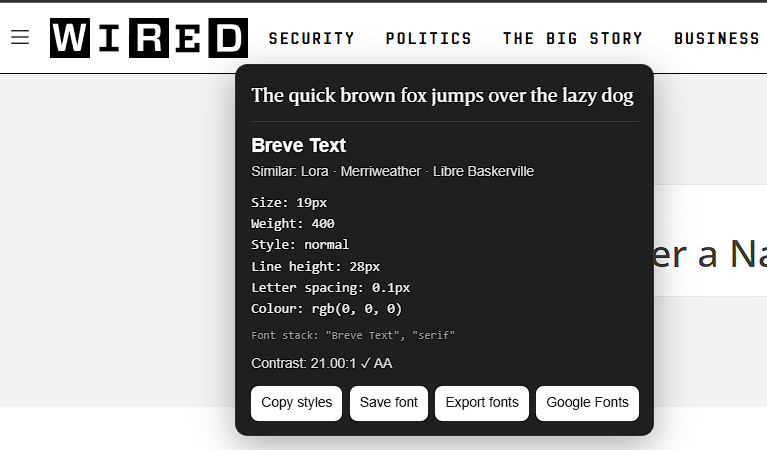

# HoverFont

**Inspect the typography behind any webpage — just hover.**

HoverFont is a lightweight Chrome extension that makes it quick and easy to explore the typography used across the web.

Turn HoverFont on, hover over text, and instantly see the font and styling being used — without digging through DevTools.



---

## Features

### Instant font inspection

Hover over text on almost any webpage to quickly see:

* Primary font
* Similar font alternatives
* Font size
* Font weight
* Font style
* Line height
* Letter spacing
* Text colour
* Contrast ratio
* CSS font stack

### Similar font suggestions

HoverFont suggests alternative fonts based on the detected primary typeface, making it easier to discover fonts with a similar visual direction.

Suggestions are generated locally within the extension, with no external API required.

### Save fonts

Found something you like?

Save fonts while browsing and keep track of interesting typography for later.

### Export saved fonts

Export your saved font collection whenever you need it.

### Copy styles

Quickly copy the typography styling from an inspected element for use in your own projects.

### Google Fonts lookup

Jump directly from HoverFont to Google Fonts to search for the detected typeface.

### Contrast checking

HoverFont calculates the contrast between the text and its background and displays the contrast ratio directly inside the inspector.

### Persistent ON / OFF state

Turn HoverFont on once and it stays on while you browse between webpages.

Your selected state is remembered even after restarting Chrome.

### Keyboard shortcut

Toggle HoverFont without opening the extension popup:

**Windows / Linux**

```text
Ctrl + Shift + F
```

**macOS**

```text
Command + Shift + F
```

The current HoverFont state is always visible from the small indicator in the bottom-right corner of the webpage.

---

## How it works

1. Turn HoverFont on from the Chrome extension popup or keyboard shortcut.
2. Visit a normal webpage.
3. Hover over any text.
4. HoverFont displays the detected typography directly beside it.
5. Copy, save or explore the font if you want to use it later.

HoverFont automatically runs across normal HTTP and HTTPS webpages while enabled.

Chrome internal pages such as:

```text
chrome://extensions
chrome://settings
```

do not allow extension content scripts to run.

---

## Local installation

HoverFont is currently available as a development build.

To install it locally:

1. Download or clone this repository.
2. Open Chrome.
3. Navigate to:

```text
chrome://extensions
```

4. Enable **Developer mode**.
5. Click **Load unpacked**.
6. Select the HoverFont project folder containing `manifest.json`.
7. Open or refresh a normal webpage.
8. Turn HoverFont on and start hovering.

---

## Project structure

```text
HoverFont/
├── manifest.json
├── content.js
├── background.js
├── popup.html
├── popup.js
├── icon16.png
├── icon48.png
├── icon128.png
├── hoverfont-demo.png
└── README.md
```

---

## Built with

HoverFont is built using:

* JavaScript
* HTML
* CSS
* Chrome Extensions API
* Chrome Storage API
* Chrome Commands API
* Manifest V3

No frontend framework is required.

---

## Privacy

HoverFont is designed to work locally in the browser.

Typography inspection and similar-font suggestions are processed within the extension.

Saved fonts are stored using Chrome's local extension storage.

HoverFont does not require an account to use.

---

## Current status

HoverFont is currently a working development build.

**Current version:** `1.0.6`

The extension is being reviewed and polished ahead of a potential Chrome Web Store release.

Current priorities include:

* Reliable font inspection
* Useful similar-font suggestions
* Simple, lightweight interaction
* Code and permissions review
* Chrome Web Store readiness

---

## Possible future improvements

* Expanded similar-font recommendations
* Improved webfont detection
* Better saved font collection tools
* Additional typography insights
* Chrome Web Store release

---

## Why HoverFont?

There are plenty of ways to inspect CSS in a browser.

HoverFont is designed for the moments when you **don't want to inspect CSS**.

Sometimes you simply see typography you like and want to know:

**What font is that?**

HoverFont aims to answer that in seconds.

